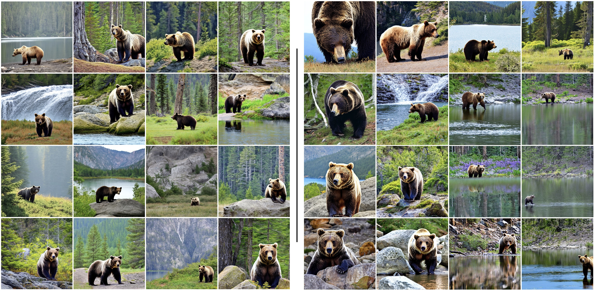

# Quality Diversity through Human Feedback

### Official Python implementation of the paper [Quality Diversity through Human Feedback](https://arxiv.org/abs/2310.12103) (Spotlight at [NeurIPS 2023 ALOE Workshop](https://sites.google.com/view/aloe2023)).

### [Project Page](https://liding.info/qdhf/) | [Paper](https://arxiv.org/abs/2310.12103) | [Cite](#citation)
[Li Ding](https://liding.info/), [Jenny Zhang](https://www.jennyzhangzt.com/), [Jeff Clune](http://jeffclune.com/), [Lee Spector](https://lspector.github.io/), [Joel Lehman](http://joellehman.com/)

**TL;DR:** QDHF derives diversity representations from human feedback and optimizes for diverse, high-quality solutions that are aligned with human intuitions. 


<p align="center">
QDHF (right) improves the diversity in text-to-image generation results compared to best-of-N (left) using Stable Diffusion. 
</p>

## Updates
**2023-12-13**: Initial release of the codebase.

## Requirements

To install the requirements, run:
```
pip install -r requirements.txt
```

## Usage

For each experiment, we provide a `main.py` script to run the experiment. For example, to run the robotic arm experiment, run:
```
cd arm
python3 main.py
```
Replace `arm` with the name of the experiment you want to run.

We are working on adding more detailed documentation and a [pyribs](https://pyribs.org/) tutorial to show how to use QDHF to generate more diverse images with Stable Diffusion. Stay tuned!


<a name="citation"></a>
## Citation

If you find our work or any of our materials useful, please cite our paper:
```
@misc{ding2023quality,
      title={Quality Diversity through Human Feedback}, 
      author={Li Ding and Jenny Zhang and Jeff Clune and Lee Spector and Joel Lehman},
      year={2023},
      eprint={2310.12103},
      archivePrefix={arXiv},
      primaryClass={cs.AI}
}
```

## License
This project is under the [MIT License](LICENSE).


##  Acknowledgments
The main structure of this code is modified from the [DQD](https://github.com/icaros-usc/dqd/tree/main). Each experiment contains its own modified version of [pyribs](https://pyribs.org/), a quality diversity optimization library. The maze navigation experiment uses a modified version of [Kheperax](https://github.com/adaptive-intelligent-robotics/Kheperax). The LSI experiment uses Stable Diffusion ([huggingface/diffusers](https://github.com/huggingface/diffusers)), [OpenAI CLIP](https://github.com/openai/CLIP), and [DreamSim](https://github.com/ssundaram21/dreamsim).